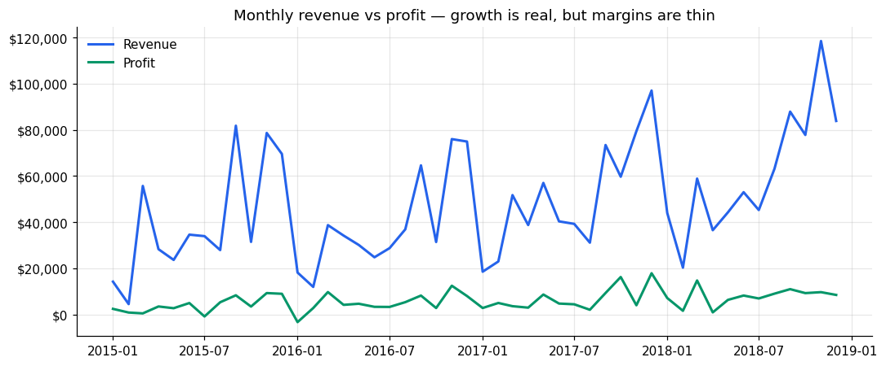
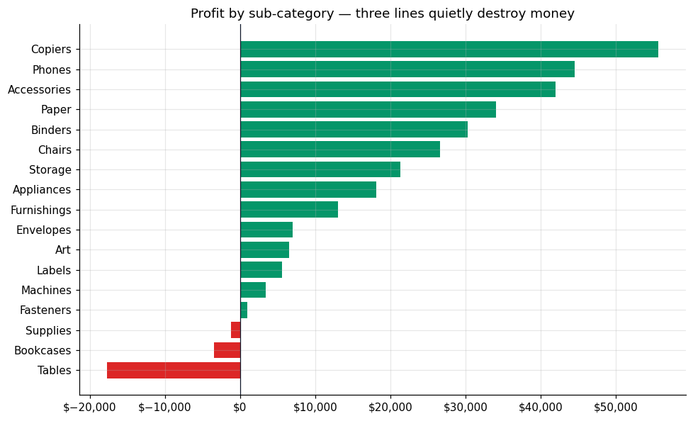
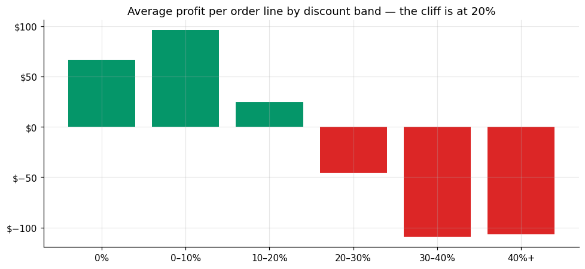
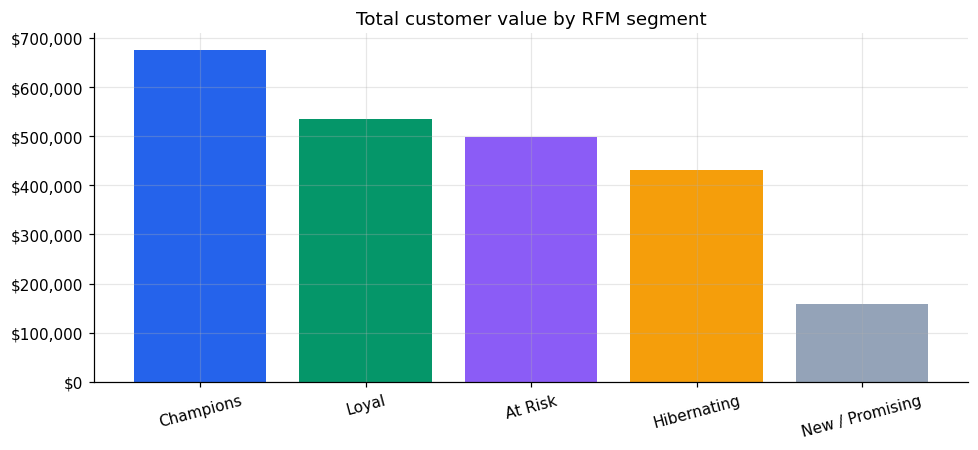

# Superstore Sales & Profitability Analysis

End-to-end exploratory analysis of ~10K retail order lines (4 years, 793
customers, 5,009 orders): data quality audit → cleaning → profitability
deep-dive → discount policy analysis → RFM customer segmentation.

**The one-line story:** revenue grows, but margin sits at **12.5%** and three
sub-categories quietly destroyed **$22K** of profit — and the data says
exactly what to do about it.

## Key findings

**1. Growth is real; profitable growth is not.**
Revenue shows strong seasonality and YoY growth while profit stays nearly
flat. Revenue-first reporting hides this.



**2. Three product lines lose money on every dollar of attention.**
Tables, Bookcases and Supplies are loss-making despite meaningful revenue —
selling more of them makes the business worse.



**3. The discount cliff is at 20%.**
Average profit per order line is healthy up to 20% discount, then collapses;
lines at 30%+ are loss-making. A 20% ceiling (manager approval beyond it)
directly protects margin.



**4. A small customer elite drives most value.**
RFM segmentation (Recency / Frequency / Monetary quintiles) shows Champions +
Loyal customers dominate revenue, while the **At Risk** segment — previously
frequent buyers gone quiet — is the highest-ROI win-back target.



## Recommendations

| # | Finding | Action |
|---|---------|--------|
| 1 | 12.5% flat margin under growing revenue | Report profit-first, not revenue-first |
| 2 | Tables / Bookcases / Supplies lose money | Reprice, renegotiate, or de-emphasize in promos |
| 3 | Profit collapses beyond 20% discount | Enforce a 20% discount ceiling |
| 4 | Value concentrated in RFM elite | Protect Champions; targeted win-back for At Risk |

## Reproduce

```bash
pip install -r requirements.txt
jupyter notebook analysis.ipynb   # or just read it on GitHub — outputs are baked in
```

Every number above is computed in [`analysis.ipynb`](analysis.ipynb) from the
raw CSV in `data/` — nothing is hand-typed.

**Tools:** Python · pandas · matplotlib · Jupyter

**Data:** Public Superstore retail dataset (mirrored in `data/superstore.csv`).
