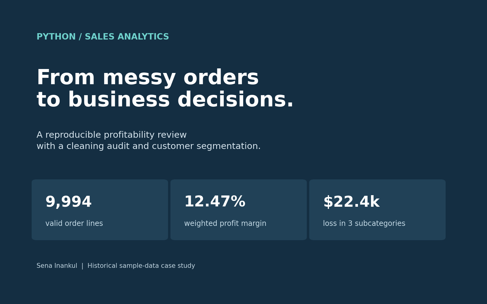

# Retail sales and profitability analysis

A reproducible portfolio example: clean an order export, answer four business questions,
and deliver an audit trail with a short client report. Data is the historical
Superstore-style sample bundled in `data/superstore.csv`, not a client engagement.

## Run

Python 3.11+ from the repository root:

```bash
python -m pip install -r requirements.txt
python sales_analysis.py
python -m pytest -q
python portfolio_figures.py
```

Read [the client report](reports/client/report.md), [the notebook](analysis.ipynb),
or [the fixed-scope service offer](SERVICE.md). Summary CSVs and a source hash are
written to `reports/client/`. The script does not modify the input file.

## Portfolio case study

Read the [two-page decision brief](reports/portfolio/Retail_Sales_Analysis.pdf).
The current [revenue and margin](reports/portfolio/revenue_and_margin.png) and
[loss-making categories](reports/portfolio/loss_making_categories.png) figures are
reproduced by `portfolio_figures.py` from the client-report tables.



## Questions answered

1. How do annual revenue, profit and weighted margin change?
2. Which subcategories report aggregate losses?
3. How does average line profit differ across discount bands?
4. Which customer groups merit a retention experiment?

The sample contains 10,800 raw rows. Removing 504 exact duplicates and then 302 invalid
rows leaves 9,994 order lines, 5,009 orders and 793 customers. Revenue totals
$2,297,200.86 and profit totals $286,397.02. The 12.47% overall margin is not a trend.
Tables, Bookcases and Supplies together report a $22,387.14 historical loss.

Discount/profit relationships are observational. This analysis does not estimate the
causal effect of a discount ceiling or claim a guaranteed campaign ROI. RFM is a
transparent heuristic; segment names use recency/frequency, while monetary value is
reported separately. See the report for interval definitions and cleaning decisions.

The original exploratory figures in `reports/figures/` are retained as historical
outputs. The client report and the revised notebook contain the current interpretation.
